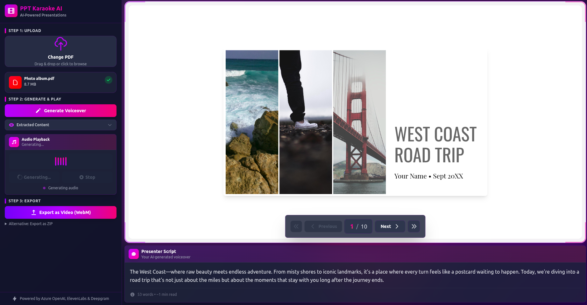

# PowerPoint Karaoke AI

<div align="center">



[](https://react.dev/)
[](https://www.typescriptlang.org/)
[](https://vitejs.dev/)
[](https://tailwindcss.com/)
[](https://opensource.org/licenses/MIT)

**Transform any PDF presentation into an AI-powered, narrated performance with intelligent language detection and video export capabilities.**

[Features](#features) • [Tech Stack](#tech-stack) • [Setup](#setup) • [Usage](#usage) • [API Configuration](#api-configuration)

</div>

---

## Features

### Core Capabilities
- **PDF Upload & Viewing**: Upload any PDF presentation and view slides with smooth navigation
- **AI Script Generation**: Azure OpenAI GPT-4o generates witty, charismatic presenter scripts with visual content extraction
- **Intelligent Language Detection**: Automatically detects Dutch or English from first 1-3 slides and maintains consistency throughout
- **Multi-Provider Text-to-Speech**:
  - ElevenLabs for Dutch voiceovers
  - Deepgram for English voiceovers
- **Smart Prefetching Pipeline**: Background generation of next slide's content, script, and audio for seamless transitions
- **Video Export**: Export complete presentation as MP4 video with synchronized audio and slide transitions
- **ZIP Export**: Alternative export option with slides as images and separate audio files

### Technical Highlights
- **Vision AI Content Extraction**: GPT-4o analyzes slides including text in images, charts, and diagrams
- **Context-Aware Script Generation**: Maintains narrative continuity using presentation history
- **Race Condition Protection**: Robust async handling with AbortController for navigation during generation
- **Comprehensive Caching**: Three-layer cache system (content, scripts, audio) for instant playback
- **Dark Theme UI**: Sleek, modern interface with gradient accents and glassmorphism effects

---

## Tech Stack

### Frontend
- **React 19.1** - UI framework with latest features
- **TypeScript 5.9** - Type safety and enhanced DX
- **Vite 7.1** - Lightning-fast build tooling
- **Tailwind CSS 4.1** - Utility-first styling with v4 architecture

### AI & APIs
- **Azure OpenAI GPT-4o** - Content extraction (Vision API) and script generation
- **ElevenLabs** - Dutch text-to-speech (aura-2-leo-en model)
- **Deepgram** - English text-to-speech (aura-2-hermes-en model)

### Media Processing
- **PDF.js** - Mozilla's PDF rendering engine
- **FFmpeg.js** - Browser-based video encoding
- **WebM Muxer** - Efficient video muxing
- **JSZip** - ZIP file generation for exports

---

## Setup

### Prerequisites
- Node.js 18+ and npm
- API keys for Azure OpenAI, ElevenLabs, and Deepgram

### Installation

1. **Clone and install dependencies**:
   ```bash
   git clone <repository-url>
   cd pptkaraoke
   npm install
   ```

2. **Configure API Keys**:

   Copy `.env.example` to `.env` and add your API credentials:

   ```env
   # Azure OpenAI (required)
   VITE_OPENAI_ENDPOINT=https://your-instance.openai.azure.com/
   VITE_OPENAI_KEY=your_azure_openai_key
   VITE_OPENAI_MODEL=gpt-4o
   VITE_API_VERSION=2025-01-01-preview

   # Deepgram TTS (required for English audio)
   VITE_DEEPGRAM_API_KEY=your_deepgram_key

   # ElevenLabs TTS (required for Dutch audio)
   VITE_ELEVENLABS_API_KEY=your_elevenlabs_key

   # Google Gemini (optional fallback)
   VITE_GEMINI_API_KEY=your_gemini_key
   ```

3. **Run the development server**:
   ```bash
   npm run dev
   ```

   Open http://localhost:5173 in your browser.

4. **Build for production**:
   ```bash
   npm run build
   ```

---

## Usage

### Basic Workflow

1. **Upload a PDF**: Click "Upload PDF" and select a presentation file
2. **Automatic Processing**:
   - First slide content is extracted automatically
   - Language detection begins after analyzing 1-3 slides
   - Scripts and audio are generated with smart prefetching
3. **Navigate & Present**: Use Previous/Next buttons to browse slides with instant playback
4. **Export**: Choose between:
   - **Video Export**: Complete MP4 with synchronized audio and transitions
   - **ZIP Export**: Individual slide images + audio files for manual editing

### Language Detection

The app automatically detects the presentation language:
- Analyzes first 1-3 slides to determine Dutch or English
- Displays language indicator with flag icon
- Maintains consistency across all slides and exports
- No manual selection required

### Smart Prefetching

The app optimizes performance by prefetching next slide:
- Content extraction while viewing current slide
- Script generation in background
- Audio pre-generated for instant playback
- All operations cancelled if user navigates away

---

## API Configuration

### Azure OpenAI
- **Purpose**: Content extraction (Vision) and script generation
- **Required Model**: GPT-4o with vision capabilities
- **Endpoint Format**: `{endpoint}/openai/deployments/{model}/chat/completions?api-version={version}`
- **Get API Key**: [Azure OpenAI Service](https://azure.microsoft.com/en-us/products/ai-services/openai-service)

### Deepgram
- **Purpose**: English text-to-speech
- **Model**: `aura-2-hermes-en`
- **Get API Key**: [Deepgram Console](https://console.deepgram.com/)

### ElevenLabs
- **Purpose**: Dutch text-to-speech
- **Model**: `aura-2-leo-en`
- **Get API Key**: [ElevenLabs](https://elevenlabs.io/)

### Google Gemini (Optional)
- **Purpose**: Fallback AI provider
- **Model**: `gemini-2.5-flash`
- **Get API Key**: [Google AI Studio](https://aistudio.google.com/apikey)

---

## Project Structure

```
pptkaraoke/
├── src/
│   ├── components/
│   │   ├── AudioControls.tsx          # Audio playback with race condition protection
│   │   ├── ControlPanel.tsx           # Main control interface
│   │   ├── FileUpload.tsx             # PDF upload component
│   │   ├── Navigation.tsx             # Slide navigation
│   │   ├── ScriptDisplay.tsx          # Script generation with prefetching
│   │   ├── SlideViewer.tsx            # PDF rendering canvas
│   │   ├── ExportVideo.tsx            # MP4 video export
│   │   └── ExportVideoSimple.tsx      # ZIP export alternative
│   ├── utils/
│   │   └── languageDetection.ts       # Multi-slide language analysis
│   ├── App.tsx                        # Root component with state management
│   └── index.css                      # Tailwind CSS configuration
├── docs/
│   └── images/
│       └── demo.png                   # Demo screenshot
├── public/
│   └── pdf.worker.min.mjs             # PDF.js web worker
└── CLAUDE.md                          # Development documentation
```

---

## Development

### Available Scripts

```bash
npm run dev      # Start Vite dev server (http://localhost:5173)
npm run build    # TypeScript compilation + production build
npm run lint     # Run ESLint
npm run preview  # Preview production build locally
```

### Key Implementation Details

- **Tailwind CSS v4**: Uses new `@import "tailwindcss"` syntax
- **PDF.js Worker**: Worker file copied to public directory via vite-plugin-static-copy
- **State Management**: Distributed caching system across three layers (content, script, audio)
- **Race Condition Handling**: AbortController pattern for cancellable async operations

See [CLAUDE.md](CLAUDE.md) for comprehensive development documentation.

---

## License

MIT License - see [LICENSE](LICENSE) file for details

---

<div align="center">

**Built with** ❤️ **using Azure OpenAI, ElevenLabs & Deepgram**

</div>
